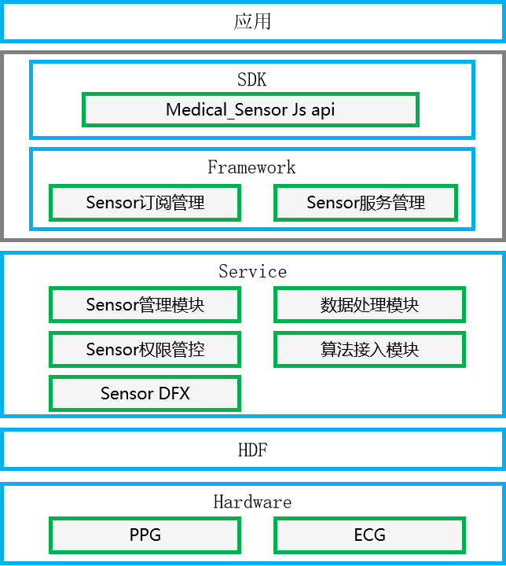

# Medical_Sensor组件<a name="ZH-CN_TOPIC_0000001148682248"></a>

-   [简介](#section11660541593)
-   [目录](#section44981327519)
-   [约束](#section98068674513)
-   [使用](#section1581412211528)
    -   [接口说明](#section15684191115524)
    -   [使用说明](#section1543714111810)

-   [相关仓](#section96071132185310)

## 简介<a name="section11660541593"></a>

传感器的介绍可以参考[sensors\_sensor](https://gitee.com/openharmony/sensors_sensor)。Medical_sensor是传感器中的健康类传感器，主要针对健康测量方面，例如测试人体心率、心电、设备的佩带情况等。此类传感器场景比较复杂并且需要算法参与，所以与传统传感器区分开来，单独实现。

传感器架构图如下所示：

**图 1**  Medical_Sensor架构图<a name="fig18632347122018"></a>  




## 目录<a name="section44981327519"></a>

medical_sensor导入模块的代码结构如下：

```
/base/sensors/medical_sensor
├── frameworks                 # 框架代码
│   └── native                 # medical_sensor客户端代码          
├── interfaces                 # 对外接口存放目录
│   ├── native                 # medical_sensor native实现
│   └── plugin                 # Js API
├── sa_profile                 # 服务名称和服务的动态库的配置文件
├── services                   # 服务的代码目录
│   └── medical_sensor         # 传感器服务，包括PPG、ECG等，上报传感器数据
└── utils                      # 公共代码，包括权限、通信等能力
```

## 约束<a name="section98068674513"></a>

-   要使用传感器的功能，设备必须具有对应的传感器器件。

-   针对某些传感器，开发者需要请求相应的权限，才能获取到相应传感器的数据。

    **表 1**  传感器权限列表

    <a name="table1379101653916"></a>
    <table><thead align="left"><tr id="row137911161397"><th class="cellrowborder" valign="top" width="23.46765323467653%" id="mcps1.2.5.1.1"><p id="p15138132134118"><a name="p15138132134118"></a><a name="p15138132134118"></a>传感器</p>
    </th>
    <th class="cellrowborder" valign="top" width="27.61723827617238%" id="mcps1.2.5.1.2"><p id="p2798169398"><a name="p2798169398"></a><a name="p2798169398"></a>权限名</p>
    </th>
    <th class="cellrowborder" valign="top" width="13.358664133586636%" id="mcps1.2.5.1.3"><p id="p14791716163914"><a name="p14791716163914"></a><a name="p14791716163914"></a>敏感级别</p>
    </th>
    <th class="cellrowborder" valign="top" width="35.55644435556444%" id="mcps1.2.5.1.4"><p id="p379171633919"><a name="p379171633919"></a><a name="p379171633919"></a>权限描述</p>
    </th>
    </tr>
    </thead>
    <tbody>
    <tr id="row20323104234015"><td class="cellrowborder" valign="top" width="23.46765323467653%" headers="mcps1.2.5.1.1 "><p id="p3139172144118"><a name="p3139172144118"></a><a name="p3139172144118"></a>心率传感器</p>
    </td>
    <td class="cellrowborder" valign="top" width="27.61723827617238%" headers="mcps1.2.5.1.2 "><p id="p7323942174013"><a name="p7323942174013"></a><a name="p7323942174013"></a>ohos.permission.READ_HEALTH_DATA</p>
    </td>
    <td class="cellrowborder" valign="top" width="13.358664133586636%" headers="mcps1.2.5.1.3 "><p id="p1232314214407"><a name="p1232314214407"></a><a name="p1232314214407"></a>user_grant</p>
    </td>
    <td class="cellrowborder" valign="top" width="35.55644435556444%" headers="mcps1.2.5.1.4 "><p id="p12323144254018"><a name="p12323144254018"></a><a name="p12323144254018"></a>允许读取健康数据。</p>
    </td>
    </tr>
    </tbody>
    </table>


## 使用<a name="section1581412211528"></a>

本节以传感器 JS API为例，说明其提供的具体功能以及使用流程。

### 接口说明<a name="section15684191115524"></a>

传感器 JS API：监听传感器数据变化，如果多次调用该接口，则最后一次调用生效。JS API开放的能力如下：

**表 2**  JS API的主要接口

<a name="table13821942165419"></a>
<table><thead align="left"><tr id="row6821194225417"><th class="cellrowborder" valign="top" width="40.11%" id="mcps1.2.3.1.1"><p id="p3822542145420"><a name="p3822542145420"></a><a name="p3822542145420"></a>接口名</p>
</th>
<th class="cellrowborder" valign="top" width="59.89%" id="mcps1.2.3.1.2"><p id="p0822942175411"><a name="p0822942175411"></a><a name="p0822942175411"></a>描述</p>
</th>
</tr>
</thead>
<tbody><tr id="row1782284211544"><td class="cellrowborder" valign="top" width="40.11%" headers="mcps1.2.3.1.1 "><p id="p18666622171316"><a name="p18666622171316"></a><a name="p18666622171316"></a>on(type: SensorType, callback: AsyncCallback&lt;Response&gt;, options?: Options)</p>
</td>
<td class="cellrowborder" valign="top" width="59.89%" headers="mcps1.2.3.1.2 "><p id="p1476355071517"><a name="p1476355071517"></a><a name="p1476355071517"></a>监听传感器数据变化。SensorType为支持订阅的传感器类型，callback表示订阅传感器的回调函数，options为设置传感器数据上报的时间间隔。</p>
</td>
</tr>
<tr id="row1489993155613"><td class="cellrowborder" valign="top" width="40.11%" headers="mcps1.2.3.1.1 "><p id="p1490010315564"><a name="p1490010315564"></a><a name="p1490010315564"></a>setOpt(type: SensorType, scene: number)</p>
</td>
<td class="cellrowborder" valign="top" width="59.89%" headers="mcps1.2.3.1.2 "><p id="p5900163115564"><a name="p5900163115564"></a><a name="p5900163115564"></a>切换健康测量的场景，例如从静态心率到动态心率的切换。</p>
</td>
</tr>
<tr id="row1909165317562"><td class="cellrowborder" valign="top" width="40.11%" headers="mcps1.2.3.1.1 "><p id="p16909135319564"><a name="p16909135319564"></a><a name="p16909135319564"></a>off(type: SensorType, callback: AsyncCallback&lt;void&gt;)</p>
</td>
<td class="cellrowborder" valign="top" width="59.89%" headers="mcps1.2.3.1.2 "><p id="p3909165315613"><a name="p3909165315613"></a><a name="p3909165315613"></a>取消订阅传感器数据。SensorType为支持的取消订阅的传感器类型，callback表示取消订阅传感器是否成功。</p>
</td>
</tr>
</tbody>
</table>

### 使用说明<a name="section1543714111810"></a>

1.  导包。
2.  注册并监听PPG传感器数据的变化。
3.  取消订阅PPG传感器数据的变化。

示例代码：

```
//步骤1 导包
import medical from '@ohos.medical';
export default {
    onCreate() {
        //步骤2 监听传感器数据变化，并注册传感器类型
        medical.on(medical.AFE_TYPE_ID_PHOTOPLETHYSMOGRAPH, (error, data) => {
            if (error) {
                console.error("Failed to subscribe to ppg data. Error code: " + error.code + "; message: " + error.message);
                return;
            }
            console.info("PPG data obtained. data: " + data.dataArray);
        });
    }
    onDestroy() {
        console.info('AceApplication onDestroy');
        //步骤3 取消订阅传感器数据
        medical.off(sensor.AFE_TYPE_ID_PHOTOPLETHYSMOGRAPH, function(error) {
            if (error) {
                console.error("Failed to unsubscribe from ppg data. Error code: " + error.code + "; message: " + error.message);
                return;
            }
            console.info("Succeeded in unsubscribe from sensor data");
        });
    }
}
```

## 相关仓<a name="section96071132185310"></a>

泛Sensor服务子系统

**sensors\_medical\_sensor**

[sensors\_sensor](https://gitee.com/openharmony/sensors_sensor)

[sensors\_miscdevice](https://gitee.com/openharmony/sensors_miscdevice)

